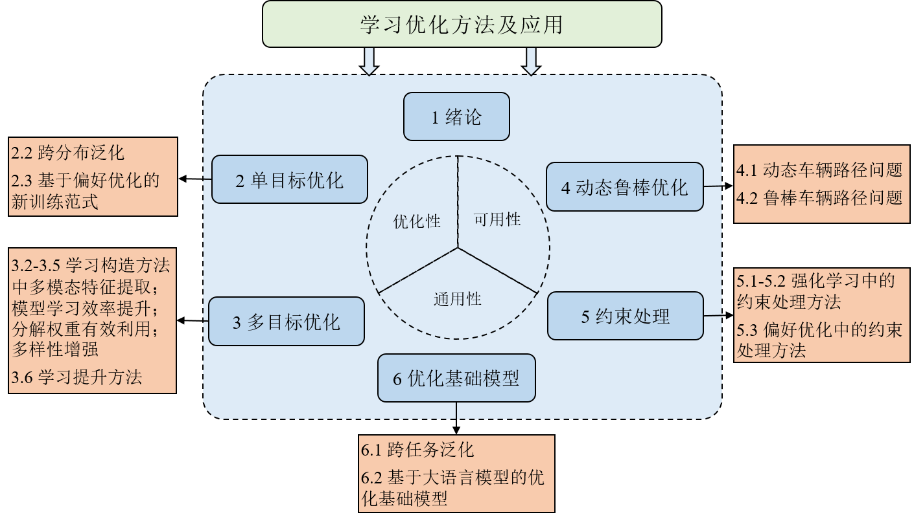

# 《学习优化方法及应用》

## 📚 书籍介绍

优化问题是科学与工程领域中一个非常重要的研究课题，因为现实世界中的大多数工程问题都可以归结为优化问题。组合优化是运筹优化问题中最具挑战的研究方向之一，也是人工智能从感知走向认知决策的重要组成部分和数学工具，在计算机科学中发挥着基础性的作用。

在当前大数据与人工智能深度融合的时代背景下，基于机器学习（深度强化学习）与大语言模型的学习优化方法应运而生，为复杂组合优化问题的求解开辟了新的研究范式。学习优化算法通过机器学习模型学习得到一个启发式算法，表示为一个训练好了的模型，可以实现一次（离线）训练多次（在线）求解，针对没有见过的问题实例，模型快速生成一个优质解，不需要像传统智能优化算法那样，面对每一个问题的不同算例，都要从初始解开始重新迭代寻优。学习优化方法的优点可以总结为：算法设计的自动性，生成实例解的快速性，求解同类问题的通用性/泛化性。本书总结我们近年来在学习优化方法领域的成果，并在大语言模型快速发展的人工智能新时代，展望面向复杂组合优化问题的学习优化新进展，对于促进未来相关领域的研究具有重要的意义。

我们期望，本书的出版为学习优化方法初学者提供入门帮助，为学术界与工业界的研究者提供一些新的参考，激发不同的创新思路，共同推进学习优化方法的研究和应用。

全书内容总共六章，第一章概述了学习优化方法的发展现状。第二章聚焦单目标优化，主要包括单目标优化中泛化问题和不同于强化学习的模型训练范式—基于偏好优化的训练方法。第三章聚焦多目标优化，分别从提升模型学习效率、有效利用权重向量、有效提取实例特征和增强解的多样性四方面提出了对应的方法，最后提出了一个学习提升的多目标优化算法。第四章聚焦动态鲁棒优化，主要介绍实际场景中动态旅行商问题和不确定信息下鲁棒车辆路径问题的求解。第五章聚焦约束处理方法，学习优化方法一般在构造解的过程中用掩码机制处理约束，在复杂约束优化问题中，如何提升约束处理的效果，我们提出了软硬约束结合的两阶段方法，以及奖励和多样性引导的约束处理机制。最后介绍了在基于偏好优化的训练方法中如何处理约束的新方法。第六章聚焦迈向通用优化基础模型。首先提出了跨任务的学习优化方法，然后进一步介绍基于大语言模型的通用优化模型。最后对全书内容进行了总结，对将来研究进行了展望。

总结而言，第二章和第三章分别提升单、多目标学习优化方法的优化性能。第四章和第五章分别提升学习优化方法在动态、不确定的实际场景中解决动态、鲁棒优化问题的实用性，以及解决复杂约束优化问题的可用性。第六章提升学习优化方法的通用性，以迈向通用的学习优化基础模型。全书各章内容安排及其联系如图所示：

全书内容全面。学习方法方面，包含深度强化学习和大模型方法。优化问题方面，从单目标优化问题，到多目标优化问题，再到实际场景中的动态鲁棒优化问题。还对复杂约束问题中的约束处理方法进行了专门介绍。应用问题方面，包括旅行商问题、车辆路径问题、作业车间调度、背包问题等。其中车辆路径问题包括实际场景中的带时间窗的非对称电动车辆路径问题，和24个车辆路径问题变种。通用性方面，包含同一问题的不同实例泛化，到同一族问题的不同问题变种泛化，最后到不同结构不同组合优化问题的泛化，迈向学习优化通用基础模型。

- **官方购买链接**: [点击购买](链接)

## 📚 关于本书

为了更好地普及和传播大模型技术的最新进展与技术体系，我们编写了这本《大语言模型》。本书定位为**大模型初学者的系统性技术指南**，提供了完整的大模型技术框架和路线图。

### 🗓️ 编写历程
- **2023年3月**：发布英文综述《A Survey of Large Language Models》（已更新至v14，95页正文，1064篇参考文献）
- **2023年8月**：发布v10版本中文翻译版
- **2023年12月**：启动中文书编写工作
- **2024年4月**：完成初稿
- **2024年9月**：正式出版（历时5个月修订完善）

### 🎯 本书特色
✅ **系统全面**：为大模型初学者提供整体技术讲解，构建系统的大模型技术框架和路线图  
✅ **基础友好**：适用于具有深度学习基础的读者，作为基础的大模型参考书籍  
✅ **精准提炼**：基于经典论文、相关代码和学术教材，提炼核心概念、算法与模型  
✅ **持续更新**：本书出版是起点，将持续进行内容更新和完善  

### 📖 内容定位
与英文综述文章的定位不同，本书更关注为大模型初学者提供整体的技术讲解，内容上进行了大范围的更新与重组，力图展现一个系统的大模型技术框架和路线图。

> **编者注**：在图书编写过程中，我们深感自身能力与知识的局限性，尽管已经付出了巨大的努力，但仍难免会有遗漏或不足之处。本书的出版仅是一个起点，我们将编写此书的过程也作为一个自身的学习过程，希望能够通过本书与读者进行深入交流，向更多的行业同行学习。

## 🌟 推荐语

### 张宏江
**北京智源人工智能研究院学术顾问委员会主任、美国国家工程院外籍院士**

> "本书的编者长期从事大模型技术的相关研究，曾组织研发了文澜、玉兰等一系列大模型，具有深厚的科研与实践积累。本书内容深入结合了编者在研发大模型过程中的第一手经验，全面覆盖了大模型技术的多方面知识，可以作为深入学习大模型技术的参考书籍，**强烈推荐阅读**！"

### 鄂维南
**北京大学讲席教授、中国科学院院士**

> "本书的编写团队于2023年3月发布了学术界首篇大语言模型综述文章'A Survey of Large Language Models'，受到了广泛关注。在这篇经典综述文章基础上，编写团队对编写内容进行了精心组织与撰写，并且融入了其长期从事大模型技术的科研经验。本书具有重要的参考与学习价值，是一部值得推荐的大模型佳作。"

### 张亚勤
**清华大学智能科学讲席教授、中国工程院外籍院士**

> "大模型作为一种快速兴起的人工智能技术，已经深刻地影响了未来的科技发展趋势。为了更好地推进大模型技术在我国的学习与普及，亟须有专业的中文技术图书进行系统介绍。本书是一部精心编写的大模型技术图书，涵盖了预训练、微调、对齐、提示工程等众多基础内容，能够为相关从业人员提供权威的、系统的学习参考，**强烈推荐阅读**。"

### 章节目录

| 对应章节 | 主要内容 |
|----------|----------|
| **第一章** | xxxx |
| **第二章** | xxxx |
| **第三章** | xxxx |
| **第四章** | xxxx |
| **第五章** | xxxx |
| **第六章** | xxxx |
| **第七章** | xxxx |

## 👥 内容贡献

### 各章节负责人

| 章节 | 负责人 | 参与人 |
|------|--------|--------|
| **第一章** | 闵映乾、杨晨 | 李军毅、周昆 |
| **第四章** | 张君杰、侯宇蓬、周昆 | - |
| **第五章** | 董梓灿 | 田震、唐天一 |
| **第六章** | 唐天一、陈昱硕 | - |
| **第七章** | 唐天一 | 成晓雪 |
| **第八章** | 李军毅 | 陈志朋 |
| **第九章** | 陈昱硕、刘沛羽、唐天一 | 周昆 |
| **第十章** | 李军毅、汤昕宇、都一凡 | 王晓磊 |
| **第十一章** | 任瑞阳、蒋锦昊 | 李军毅 |
| **第十二章** | 张北辰、周昆 | 张高玮 |
| **第十三章** | 周昆 | 蒋锦昊、李依凡、刘子康、孙文奇、王禹溴、徐澜玲、杨锦霞、郑博文 |

| 对应章节 | 主要内容 | 负责人 |
|----------|----------|----------|
| **第一章** | xxxx | xxxx |
| **第二章** | xxxx | xxxx |
| **第三章** | xxxx | xxxx |
| **第四章** | xxxx | xxxx |
| **第五章** | xxxx | xxxx |
| **第六章** | xxxx | xxxx |
| **第七章** | xxxx | xxxx |

| 章 | 节 | 论文 | 源码 | 备注 |
|------|----------|----------|----------|----------|
| **第一课** | 第一章 | 初识大模型：语言模型发展历程 |大模型技术基础、GPT和DeepSeek模型介绍 |大模型技术基础、GPT和DeepSeek模型介绍 |
|  | 第二章 | 大模型技术基础、GPT和DeepSeek模型介绍 |大模型技术基础、GPT和DeepSeek模型介绍 |大模型技术基础、GPT和DeepSeek模型介绍 |
| **第二课** | 第五章 | 模型架构：Transformer模型介绍、模型详细配置、长上下文模型和新型架构 |大模型技术基础、GPT和DeepSeek模型介绍 |大模型技术基础、GPT和DeepSeek模型介绍 |
| **第三课** | 第四章 | 预训练：预训练之数据工程 |大模型技术基础、GPT和DeepSeek模型介绍 |大模型技术基础、GPT和DeepSeek模型介绍 |
|  | 第六章 | 训练优化、模型参数量与训练效率估计 |大模型技术基础、GPT和DeepSeek模型介绍 |大模型技术基础、GPT和DeepSeek模型介绍 |
| **第四课** | 第七章 | 指令微调：指令微调与常见策略、轻量化微调 |大模型技术基础、GPT和DeepSeek模型介绍 |大模型技术基础、GPT和DeepSeek模型介绍 |
| **第五课** | 第八章 | 人类对齐：人类对齐之基础、人类对齐之进阶 |大模型技术基础、GPT和DeepSeek模型介绍 |大模型技术基础、GPT和DeepSeek模型介绍 |
| **第六课** | 第九章 | 解码与部署：大模型解码、解码效率分析与加速算法、模型压缩 |大模型技术基础、GPT和DeepSeek模型介绍 |大模型技术基础、GPT和DeepSeek模型介绍 |
| **第七课** | 第十章 | 提示学习：提示设计、上下文学习、思维链提示、检索增强生成 |大模型技术基础、GPT和DeepSeek模型介绍 |大模型技术基础、GPT和DeepSeek模型介绍 |
| **第八课** | 第十一章 | 复杂推理：规划与智能体、复杂推理与慢思考 |大模型技术基础、GPT和DeepSeek模型介绍 |大模型技术基础、GPT和DeepSeek模型介绍 |
| **其他章节** | 第十二章等 | 大模型资源、大模型评测 |大模型技术基础、GPT和DeepSeek模型介绍 |大模型技术基础、GPT和DeepSeek模型介绍 |

### 其他贡献者

**参与本书编写、校对的同学**：

邹政、余紫康、罗浚艺。

### 🙏 特别感谢

**算力资源支持**：

**感谢老师**：

## 💬 反馈意见

### 反馈渠道

如果您有任何意见、评论以及建议（请先确认最新版本中是否已经修正）：

1. **GitHub Issues**：通过项目的Issues页面反馈
2. **邮件联系**：
   - `xxxxx`
   - `xxxxx`

## 📁 资源下载
- [配套代码下载](链接)
- [数据集下载](链接)

